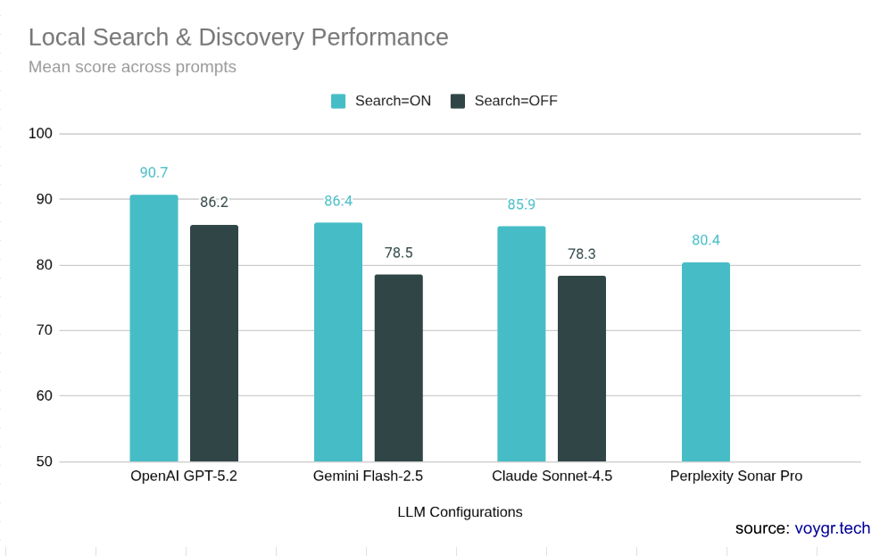
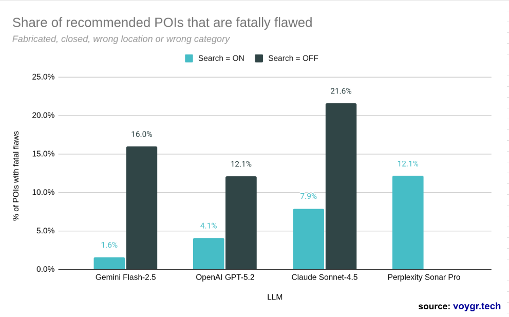

# LLM Local Search Benchmark: How Claude, GPT, Gemini, and Perplexity Handle Real-World Place Queries

> LLMs can write poetry and pass bar exams, but ask them to find an open restaurant nearby and they'll confidently send you to a place that closed two years ago.

We tested **4 leading LLMs** on **345 real-world local search prompts** (finding restaurants, checking hours, planning routes, booking tables) across **50+ cities on 6 continents**. Each provider was tested with and without web search (**2,415 total evaluations**). Every recommended place was verified against Google Search and Google Maps.

This page presents the key findings. For the complete analysis (per-category breakdowns, full failure taxonomy, geographic gap deep dive, methodology details, and all 345 benchmark prompts), **[get the full report](#get-the-full-report)**.

---

## Overall Performance

  

<table>
<tr>
<th>Provider</th><th>Model</th><th>Score (/100)</th><th>Completeness</th><th>Accuracy</th><th>Constraint Match</th><th>Plausibility</th>
</tr>
<tr>
<td><strong>OpenAI ON</strong></td><td>gpt-5.2</td>
<td><strong>90.7</strong></td>
<td>100%</td>
<td>92%</td>
<td>85%</td>
<td>91%</td>
</tr>
<tr>
<td><strong>Gemini ON</strong></td><td>gemini-2.5-flash</td>
<td>86.4</td>
<td>91%</td>
<td>92%</td>
<td>77%</td>
<td>76%</td>
</tr>
<tr>
<td><strong>Claude ON</strong></td><td>claude-sonnet-4-5</td>
<td>85.9</td>
<td>99%</td>
<td>89%</td>
<td>76%</td>
<td>79%</td>
</tr>
<tr>
<td><strong>Perplexity ON</strong></td><td>sonar-pro</td>
<td>80.4</td>
<td>97%</td>
<td>86%</td>
<td>69%</td>
<td>71%</td>
</tr>
</table>

>  90%+ ·  80-89% ·  70-79% ·  <70%

OpenAI leads by 4.3 points. No single provider wins everything, though. Rankings shift by task type. And even the best performer recommends a place that doesn't exist, is permanently closed, or is in the wrong neighborhood **8% of the time**.

### The Consistency Gap

Averages hide the real story. The differentiator isn't the mean; it's how often things go *badly* wrong:

| Provider | Scored 90+ | Scored <70 |
|---|---|---|
| **OpenAI ON** | 69% | 8% |
| **Gemini ON** | 59% | 16% |
| **Claude ON** | 52% | 15% |
| **Perplexity ON** | 37% | 24% |

OpenAI scores 90+ on 7 out of 10 prompts. Perplexity scores below 70 on nearly 1 in 4. A product built on these APIs is only as good as its worst response.

---

## Finding 1: Are These Places Even Real?

We asked Claude (without search) to rank the top 5 yoga studios in Hawthorne District, Portland. It returned five studios with class prices, instructor specialties, and detailed descriptions. **Four of five are completely fabricated.** The model never hedged.

Without search, **1 in 5 places Claude recommends** has a fatal flaw: fabricated, permanently closed, or wrong location. Even Perplexity, a search-native product, has a 12% failure rate with search enabled.

  

| Failure Type | What Happens | Example |
|---|---|---|
| **Fabrication** | LLM invents a place with confident false details | 4/5 yoga studios in Portland don't exist, complete with prices and instructor bios |
| **Permanently closed** | LLM recommends a shuttered venue | All 7 configs gave booking advice for Proper, Buenos Aires (closed) |
| **Wrong location** | Place is real but in the wrong neighborhood | Asked for Condesa cantinas, got places from Centro and Coyoacan |
| **Wrong category** | Place exists but is a different type of business | Asked for tobacco shops, got shopping malls and a supermarket |

**The permanently closed blind spot** is arguably scarier than hallucination. We asked all 7 configs to help book a table at Proper in Buenos Aires, a permanently closed restaurant. Every single one cheerfully provided booking guidance to a shuttered building. Even search-equipped models didn't catch it. No provider reliably detects when a place has closed.

> The full report includes fatal flaw rates by provider and search config, the complete failure taxonomy with real examples from every provider, and the "confidently wrong" pattern analysis.

---

## Finding 2: Web Search Sometimes Makes LLMs Worse

Enabling search helps when you're looking for places (+10 to +21 points on discovery). On transactional tasks ("help me book a table"), it actively hurts:

<table>
<tr>
<th>Provider</th><th>Search OFF</th><th>Search ON</th><th>Delta</th>
</tr>
<tr>
<td>OpenAI</td>
<td>87.8</td>
<td>88.9</td>
<td>+1.1</td>
</tr>
<tr>
<td>Gemini</td>
<td>84.0</td>
<td>78.7</td>
<td><strong>-5.3</strong></td>
</tr>
<tr>
<td>Claude</td>
<td>89.6</td>
<td>84.1</td>
<td><strong>-5.5</strong></td>
</tr>
</table>

*Merchant/booking task scores. Claude and Gemini lose 5+ points with search enabled.*

**Why?** Search returns facts *about* a place instead of guidance on *how to act*. Without search, models give step-by-step booking advice ("call this number, ask for a window seat"). With search, they get distracted by retrieved content and return factual snippets instead of actionable instructions. OpenAI is the exception: it integrates search results *into* guidance rather than replacing guidance with search results.

The pattern extends to navigation: Gemini's own Maps grounding makes it *worse* at giving directions (-2.0). The provider with the world's best navigation tools scores lower when those tools are enabled.

> The full report includes the complete search paradox analysis across all 5 task categories, the Gemini token budget bug deep dive, and detailed before/after examples.

---

## Finding 3: Each Provider Has a Distinct Personality

Rankings shift dramatically by task type:

<table>
<tr>
<th>Use Case</th><th>Prompts</th><th>OpenAI ON</th><th>Gemini ON</th><th>Claude ON</th><th>Perplexity ON</th>
</tr>
<tr>
<td><strong>Obtain Place Details</strong></td><td>100</td>
<td><strong>94.7</strong></td>
<td>93.2</td>
<td>91.4</td>
<td>88.1</td>
</tr>
<tr>
<td><strong>Share with Others</strong></td><td>30</td>
<td>94.5</td>
<td><strong>96.1</strong></td>
<td>92.6</td>
<td>83.2</td>
</tr>
<tr>
<td><strong>Plan / Navigate</strong></td><td>80</td>
<td><strong>91.0</strong></td>
<td>81.0</td>
<td>89.2</td>
<td>82.5</td>
</tr>
<tr>
<td><strong>Engage Merchant</strong></td><td>30</td>
<td><strong>88.9</strong></td>
<td>78.7</td>
<td>84.1</td>
<td>87.1</td>
</tr>
<tr>
<td><strong>Explore / Discover</strong></td><td>105</td>
<td><strong>86.9</strong></td>
<td>84.0</td>
<td>77.8</td>
<td>70.2</td>
</tr>
</table>

>  90+ ·  80-89 ·  70-79 ·  <70

- **OpenAI**: The reliable all-rounder. Leads or ties in 4 of 5 categories. Best consistency (std dev 13.0). The provider you pick when you can't afford failures.
- **Gemini**: The specialist with extremes. Best foundational accuracy (1.6% fatal rate) thanks to Maps grounding, but last on booking and navigation, where that same grounding *hurts*.
- **Claude**: The solid middle. Never the worst, rarely the best. Quietly strong on trip planning: give it an arrival time and it excels at working backwards.
- **Perplexity**: The search-native underdog. Competitive on booking (beats Claude and Gemini), but can't generate a working Maps link and has the highest discovery failure rate.

### The Geographic Gap

We split prompts into USA/Western Europe vs Rest of World. The gap is modest on averages (+1 to +3 points) but explodes on specific tasks: reservation prompts for ROW restaurants are dramatically harder. Well-known ROW landmarks (Grand Bazaar Istanbul: 99.2, Ghibli Museum: 98.5) perform at Western levels. The gap isn't geography; it's data coverage.

> The full report includes search ON vs OFF scores for all 7 configs across all 5 categories, the geographic gap breakdown by task type, and the complete constraint fidelity analysis.

---

## What This Means If You're Building on LLM APIs

1. **Raw LLM output is not production-ready.** Even OpenAI at 90.7 has an 8% catastrophic failure rate. You need a verification layer: existence checks, operating status, location constraints.
2. **Don't blindly enable search.** It helps discovery but hurts transactions. The optimal strategy is task-aware routing.
3. **The accuracy gap is a data problem, not a prompt engineering problem.** Perplexity has native search and still recommends closed places. Fresh, verified place data is the missing layer.
4. **Test on non-Western markets.** The USA/WE vs ROW gap is modest on averages but explodes on specific tasks.
5. **On-device models will struggle hard.** Without grounding, fatal flaw rates hit 12-22%. Edge-deployed models need a pre-verified local place database.

---

## Methodology at a Glance

- **345 prompts** across 5 use case categories, **4 LLM providers** in 7 configurations (search on/off), **2,415 evaluated responses**
- Geographic coverage: 50+ cities across 6 continents (~30% USA/WE, ~70% ROW)
- All responses generated and evaluated Feb-Mar 2026

**Evaluation pipeline**: Each response goes through automated Extract > Verify > Score phases using Gemini as judge, with every entity independently fact-checked against Google Search and Google Maps.

**Rubric (out of 100):**

| Component | Points | What It Measures |
|---|---|---|
| Completeness (R1) | /20 | Right number of results, right format, all sub-questions answered |
| Foundational Accuracy (R2) | /40 | Are the places real, open, and where the LLM says they are? |
| Constraint Fidelity (R3) | /30 | Do recommendations match what the user actually asked for? |
| Plausibility (R4) | /10 | Would a knowledgeable local find this response sensible? |

A single "fatal flaw" (fabricated place, permanently closed venue, wrong neighborhood) zeros the entity's score and counts 2x in the denominator, because a hallucinated place is worse than a missing one.

> The full report includes detailed methodology, rubric design rationale, judge reliability analysis, and all 345 benchmark prompts.

---

## Get the Full Report

The complete analysis includes:

- **Per-category breakdowns** with detailed score tables across all 7 provider configurations
- **The complete failure taxonomy** with real examples from every provider and the "confidently wrong" pattern
- **Search paradox deep dive**: where search helps, where it hurts, and why, across every task type
- **Geographic gap analysis**: USA/Western Europe vs Rest of World, by category and provider
- **Constraint fidelity analysis**: budget constraints, subjective constraints, negative constraints
- **Full evaluation methodology**, rubric design, judge reliability, and all 345 benchmark prompts

**[Download the Full Report (PDF) →](https://PLACEHOLDER_EMAIL_CAPTURE_URL)**

---

## Bridging the Gap: Point Validation API

The failure modes we found (fabricated places, closed venues, wrong locations) are verifiable, automatable checks. We built a **Point Validation API** that sits between LLM output and your users, catching these failures before they reach production.

Pass in a place name and location from any LLM response and get back: existence verification, operating status, name/category resolution, and location constraint checks. These are the exact checks that would have caught every fatal flaw in this benchmark.

**[Try the API →](https://PLACEHOLDER_API_DOCS_URL)** · [See the docs on GitHub](https://PLACEHOLDER_API_REPO_URL)

---

## About

Built by [VOYGR](https://voygr.tech). Comprehensive, up-to-date place data and intelligent local search for AI apps, agents, and analytics.

The benchmark framework, all prompts, and raw results will be open-sourced soon. We plan to rerun it as new model versions ship and expand to developer-focused use cases (geocoding, GeoJSON, batch POI validation).

[voygr.tech](https://voygr.tech) · [founders@voygr.tech](mailto:founders@voygr.tech)
